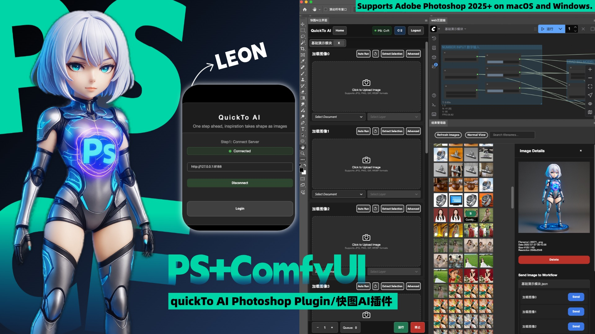

# ComfyUI-Photoshop-QTLeon 快图 PS 插件开源指南

中文 | [English](README_EN.md)



### 📽️ 视频操作教程（共六部）

<div align="center">

[](https://youtu.be/4CUP8-5TapY)

</div>
## 🌟 项目介绍

> 🎨 打造 ComfyUI 与 Photoshop 的完美桥梁

### 📝 项目背景

在深入 ComfyUI 生态系统一年多的探索之旅中，我开发了这款连接 Photoshop 和 ComfyUI 的专业插件。作为企业级项目的精简版本，它保留了核心功能，同时更加轻量易用。

- 🚀 **开发时间：** 2025 年 3 月起

### ⭐ 核心特性

> 快人一步，灵感落成图

1. 🎛️ **模块化设计**

   - 预设 10 种输入输出模块
   - 支持自定义工作流封装

2. 🖼️ **可视化管理**
   - PS 内置结果管理器
   - 图片生成实时预览
3. 🔄 **参数管理**
   - 历史参数一键复用
   - 无缝工作流集成
4. 📊 **系统功能**
   - 完整运行日志追踪
   - 双语界面（中英文）

<details open>
<summary>GIF：PS内打开Web页面</summary>


</details>

<details open>
<summary>GIF：抓取图片的选区并自动设置蒙版</summary>


</details>

<details open>
<summary>GIF：文字输入功能</summary>


</details>

<details open>
<summary>GIF：翻译模块功能</summary>


</details>

<details open>
<summary>GIF：结果管理器数值发送</summary>


</details>

<details open>
<summary>GIF：结果管理器图片发送</summary>


</details>

<details open>
<summary>GIF：自动模式演示</summary>


</details>

📽️ **更多精彩功能演示请查看下方视频！**

### 🔔 开源说明

> v1 版本由于我的时间不足，暂时仅支持核心功能，后续会持续优化，逐步完善更多功能到开源版本

- 🚫 移除：企业端的诸多会员功能，如会员登录、服务器校验，企业 API 直接调用生图功能等
- 💬 支持：遇到问题欢迎反馈

## 1. （必要）安装插件和依赖

首先，你需要将插件下载到 `custom_nodes` 文件夹中。

1. 打开终端，下载节点文件并进入节点的根目录：

   ```bash
   cd custom_nodes/qtLeon_ps_server
   ```

   <details>
   <summary>图示：查看节点目录结构图</summary>

   
   </details>

2. 安装节点所需的依赖：

   ```bash
   pip install -r requirements.txt
   ```

3. 将插件文件放入 PS 的根目录文件夹，MacOS 案例:
   ```bash
   /Applications/Adobe Photoshop 2025/Plug-ins
   ```

## 2. （必要）修改前端项目代码

此步骤是为了修复前端代码中对于工作流状态管理逻辑中的一个潜在问题。对 `activeWorkflow` 和 `changeTracker` 状态进行空值判断，以确保其正常运行。具体代码逻辑如下：

```javascript
activeWorkflow?.changeTracker?.store();
```

1. 找到 ComfyUI 前端项目的静态文件目录。例如：

   ```bash
   /Library/Frameworks/Python.framework/Versions/3.10/lib/python3.10/site-packages/comfyui_frontend_package/static
   ```

2. 进入该目录：

   ```bash
   cd /Library/Frameworks/Python.framework/Versions/3.10/lib/python3.10/site-packages/comfyui_frontend_package/static
   ```

3. 删除此目录下的所有文件，并用插件提供的**前端内容**替换它们。

   <details>
   <summary>图示：查看前端静态文件目录</summary>

   
   </details>

## 3. （必要）设置工作流显示状态

为了让 Photoshop 端能够正确运行和监控工作流状态，你需要将 ComfyUI 的工作流面板设置为侧边栏显示。

1. 启动 ComfyUI 的后端服务器。在 ComfyUI 根目录下运行：

   ```bash
   python main.py
   ```

2. 访问 ComfyUI Web 界面：`http://127.0.0.1:8188/`

3. 点击左上角的**Logo**后，在下拉菜单中点击**设置**按钮。

   <details>
   <summary>图示：查看设置按钮位置</summary>

   
   </details>

4. 在设置菜单中的**Comfy**分栏中，找到**已打开工作流的位置**选项，并将其设置为**侧边栏**。

   <details>
   <summary>图示：查看工作流设置选项</summary>

   
   </details>

5. 如果此设置不正确，Photoshop 端将无法正确获取工作流数量，并可能报以下错误：
   ```json
   [ERROR_MESSAGES_COLLECTER] 错误来源：getWorkflowCountError [SID: EBwBoYDRg7v1_wiKAAAH] - Details: {"data": {"type": "getWorkflowCountError", "message": "获取工作流数量失败TypeError: null is not an object (evaluating '_0x4e817f['textContent']')"}}
   ```

### 4\. （可选）修改 Comfy 后端代码以监听错误信息

如果你想在 Photoshop 端接收 ComfyUI 的发送的弹窗错误信息，可以修改 `server.py` 文件。

1.  找到 ComfyUI 根目录下的 `server.py` 文件。

2.  修改第 668 行 `/prompt` 端点代码中的逻辑，在指定位置添加以下两段代码。

3.  **代码 1：** 在 705 行后添加以下代码，用于处理**工作流验证失败**的错误：

    ```python
    await self.send(
        "prompt_error",
        {"title": valid[1], "errors": valid[3]},
    )
    ```

4.  **代码 2：** 在 717 行后添加以下代码，用于处理**提交提示失败**的错误：

    ```python
    await self.send(
        "prompt_error",
        {"error": error},
    )
    ```

完整实例：

<details>
<summary>图示：查看服务器代码修改示例</summary>


</details>

<details>
<summary>图示：查看错误提示示例</summary>


</details>

## 5. 启动并使用插件

启动 Comfyui，打开 PS，在增效工具中打开使用插件。

<details>
<summary>图示：查看插件界面预览</summary>


</details>

## 作者与鸣谢

- **作者:** Leon
- **项目灵感:** 特别感谢 [Sdppp](https://github.com/zombieyang/sd-ppp) 项目提供的宝贵思路和灵感
- **致谢:** 感谢开源社区的支持和贡献，让这个项目得以实现和不断改进
