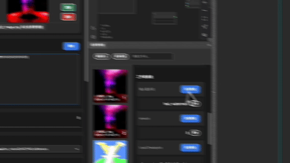
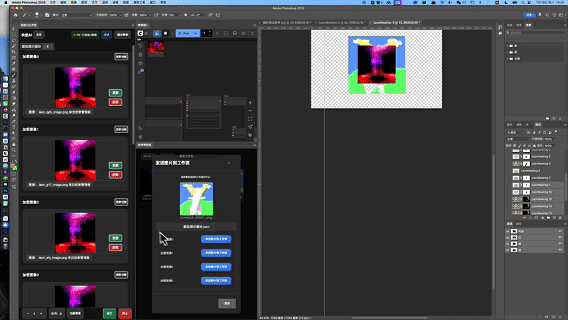
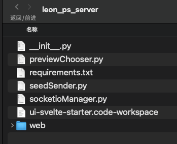
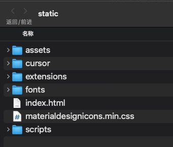
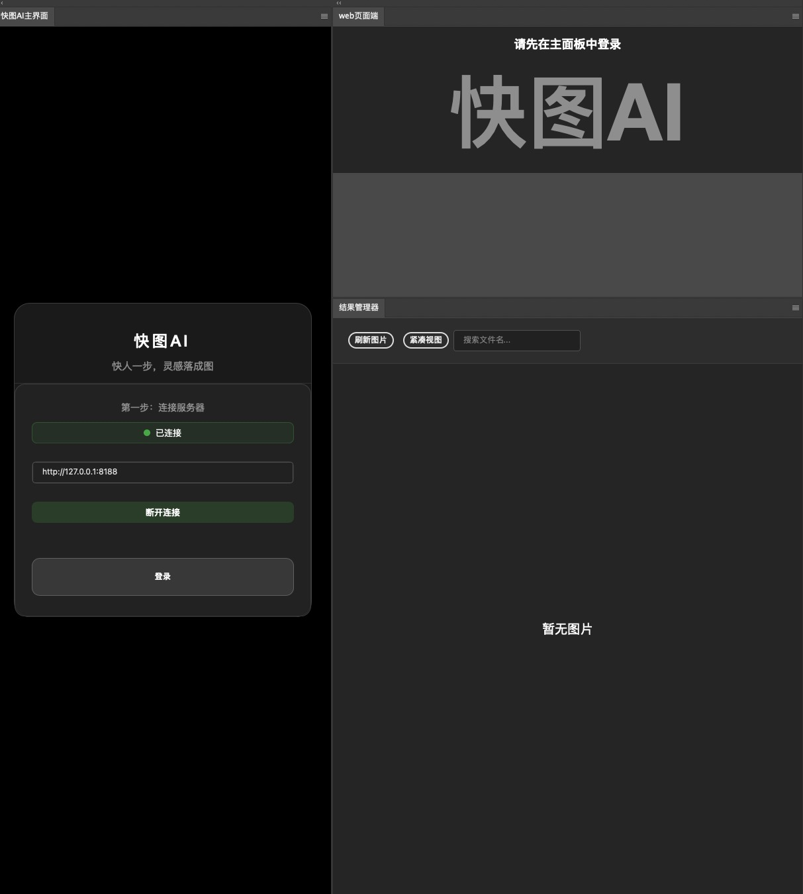

# ComfyUI-Photoshop-QTLeon Plugin Guide
[中文](README.md) | English


### 📽️ Video Demonstration（A total of six）

<div align="center">

[](https://youtu.be/4CUP8-5TapY)

</div>

## 🌟 Project Introduction

> 🎨 Creating the Perfect Bridge Between ComfyUI and Photoshop

### 📝 Background

After a year-long journey exploring the ComfyUI ecosystem, I developed this professional plugin connecting Photoshop and ComfyUI. As a streamlined version of an enterprise-level project, it maintains core functionalities while being more lightweight and user-friendly.

- 🚀 **Development:** Started March 2025
### ⭐ Core Features

> One step ahead, inspiration takes shape as images

1. 🎛️ **Modular Design**
   - 10 preset input/output modules
   - Custom workflow packaging support
   
2. 🖼️ **Visual Management**
   - Built-in PS result manager
   - Real-time image preview
   
3. 🔄 **Parameter Control**
   - One-click parameter reuse
   - Seamless workflow integration
   
4. 📊 **System Features**
   - Complete operation logging
   - Bilingual interface (CN/EN)

5. 🎬 **Feature Demonstrations**

<details open>
<summary>GIF: Opening Web Pages in PS</summary>


</details>

<details open>
<summary>GIF: Auto Selection Area & Mask Setting</summary>


</details>

<details open>
<summary>GIF: Text Input Module</summary>


</details>

<details open>
<summary>GIF: Translation Module</summary>


</details>

<details open>
<summary>GIF: Value Management</summary>


</details>

<details open>
<summary>GIF: Image Management</summary>


</details>

<details open>
<summary>GIF: Auto Mode</summary>


</details>


### 🔔 Open Source Notes

> Due to time constraints, v1 version currently only supports core features. More features will be continuously optimized and gradually added to the open-source version.

- 🚫 Removed: Enterprise member features such as member login, server verification, and enterprise API direct image generation
- 💬 Support: Feedback is welcome on any issues
- ⭐ **Special Note**: The current version is obfuscated. Once the project reaches 1000 stars, all unobfuscated source code will be released, welcoming capable developers to create their own versions


## 1. (Required) Install Plugin and Dependencies

First, you need to download the plugin to the `custom_nodes` folder.

1. Open terminal and navigate to the node root directory:
   ```bash
   cd custom_nodes/qtLeon_ps_server
   ```

   <details>
   <summary>View node directory structure</summary>
   
   
   </details>

2. Install the required dependencies:
   ```bash
   pip install -r requirements.txt
   ```

3. Place the plugin file in PS root directory, MacOS example:
   ```bash
   /Applications/Adobe Photoshop 2025/Plug-ins
   ```

## 2. (Required) Modify Frontend Project Code

This step is to fix a potential issue in the workflow state management logic of the frontend code. Add null checks for `activeWorkflow` and `changeTracker` states to ensure normal operation. The specific code logic is as follows:

```javascript
activeWorkflow?.changeTracker?.store();
```

1. Locate the static file directory of the ComfyUI frontend project. For example:
   ```bash
   /Library/Frameworks/Python.framework/Versions/3.10/lib/python3.10/site-packages/comfyui_frontend_package/static
   ```

2. Navigate to this directory:
   ```bash
   cd /Library/Frameworks/Python.framework/Versions/3.10/lib/python3.10/site-packages/comfyui_frontend_package/static
   ```

3. Delete all files in this directory and replace them with the **frontend content** provided by the plugin.

   <details>
   <summary>View frontend static file directory</summary>
   
   
   </details>

## 3. (Required) Configure Workflow Display Settings

To ensure proper operation and workflow state monitoring on the Photoshop end, you need to set the ComfyUI workflow panel to display in the sidebar.

1. Start the ComfyUI backend server. Run in the ComfyUI root directory:
   ```bash
   python main.py
   ```

2. Access the ComfyUI Web interface: `http://127.0.0.1:8188/`

3. Click the **Logo** in the upper left corner, then click the **Settings** button in the dropdown menu.

   <details>
   <summary>View settings button location</summary>
   
   
   </details>

4. In the **Comfy** section of the settings menu, find the **Open Workflows Location** option and set it to **Sidebar**.

   <details>
   <summary>View workflow settings option</summary>
   
   
   </details>

5. If this setting is incorrect, the Photoshop end will not be able to correctly get the workflow count and may report the following error:
   ```json
   [ERROR_MESSAGES_COLLECTER] Error source: getWorkflowCountError [SID: EBwBoYDRg7v1_wiKAAAH] - Details: {"data": {"type": "getWorkflowCountError", "message": "Failed to get workflow count TypeError: null is not an object (evaluating '_0x4e817f['textContent']')"}}
   ```

## 4. (Optional) Modify Comfy Backend Code to Monitor Error Messages

If you want to receive popup error messages from ComfyUI on the Photoshop end, you can modify the `server.py` file.

1. Find the `server.py` file in the ComfyUI root directory.

2. Modify the logic in the `/prompt` endpoint code at line 668 by adding the following two code segments at the specified locations.

3. **Code 1:** Add the following code after line 705 to handle **workflow validation failure** errors:
   ```python
   await self.send(
       "prompt_error",
       {"title": valid[1], "errors": valid[3]},
   )
   ```

4. **Code 2:** Add the following code after line 717 to handle **prompt submission failure** errors:
   ```python
   await self.send(
       "prompt_error",
       {"error": error},
   )
   ```

Complete example:

<details>
<summary>View server code modification example</summary>


</details>

<details>
<summary>View error prompt example</summary>


</details>

## 5. Launch and Use the Plugin

Start Comfyui, open PS, and access the plugin through the Extensions menu.

<details>
<summary>View plugin interface preview</summary>


</details>

## Author and Acknowledgments

- **Author:** Leon
- **Project Inspiration:** Special thanks to [Sdppp](https://github.com/zombieyang/sd-ppp) project for providing valuable ideas and inspiration
- **Acknowledgments:** Thanks to the open source community for their support and contributions that made this project possible and continuously improving
